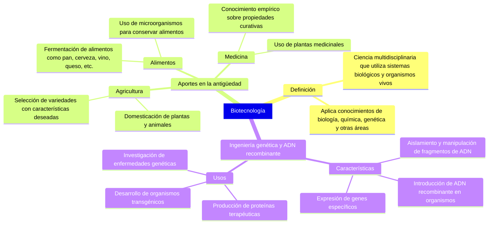

# Biologia3


```mermaid
mindmap
 [Aplicaciones de la biotecnología]
    Elaboración de transgénicos
      Organismos modificados genéticamente
      Ejemplo: Maíz resistente a plagas
    Pruebas de ADN
      Identificación de individuos y relaciones de parentesco
      Ejemplo: Pruebas de paternidad, investigación criminal
    Medicina y diagnóstico de enfermedades
      Terapias génicas, producción de anticuerpos
      Ejemplo: Diagnóstico de cáncer
    Elaboración de vacunas y antibióticos
      Producción de vacunas recombinantes
      Ejemplo: Vacuna contra la hepatitis B
    Elaboración de hormonas
      Producción de insulina, hormona del crecimiento
      Ejemplo: Insulina para tratar diabetes
    PCR
      Amplificación de secuencias de ADN
      Ejemplo: Detección de VIH
    Genómica
      Estudio del genoma completo
      Ejemplo: Proyecto Genoma Humano
    Biorremediación
      Uso de microorganismos para degradar contaminantes
      Ejemplo: Limpieza de derrames de petróleo
    Relación e impacto de nuevas tecnologías
      Beneficio de avances en nanotecnología, bioinformática, IA
      Desarrollo de herramientas más precisas
    Campos e industrias alternativos
      Bioenergía
        Producción de biocombustibles
      Materiales biodegradables
        Desarrollo de plásticos renovables
      Cosmética
        Uso de ingredientes biológicos en productos de cuidado personal
